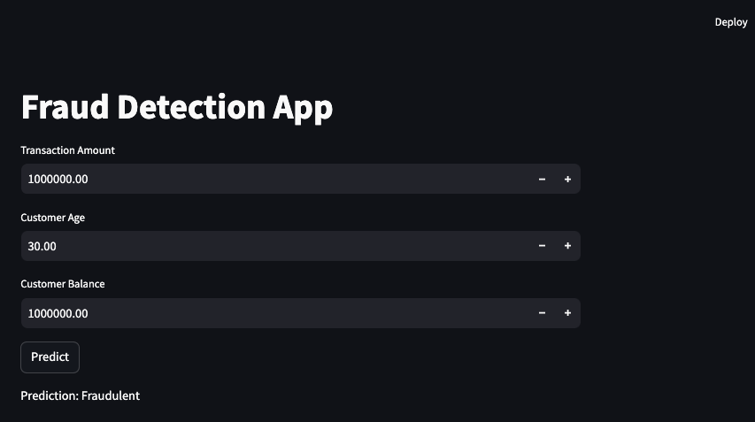

# Fraud Detection App

*This app was designed on **Data Science in Finance** course*

1. Start app for manual transaction scoring or upload csv with transactions' records for scoring based on specified model:
in terminal window 1: `uvicorn dsif11app-fraud:app --reload --port 8502`
in terminal window 2: `streamlit run dsif11app-fraud-streamlit.py`



2. Start service for real time scoring that scans target folder for incoming transactions and generates predictions based on specified model:
`cd bin/run_stream_scoring.sh`
```
bin
└───run_stream_scoring.sh
```
